# Overview

The goal of this project is that given a set of street view images and annotation tags & coordinates locating traffic signs on the images, how accurately could a Convolutional Neural Network model classify multiple labels identifying the contents from traffic lights

# Dataset Source

The dataset was downloaded from [Kaggle](https://www.kaggle.com/mbornoe/lisa-traffic-light-dataset). The dataset includes 43,008 frames and 113,888 annotated traffic lights. The frames come from footages taken with a vehicle driving under both day and night. The train dataset has 13 day clips and 5 night clips, and the test dataset has 2 day sequences and 2 night sequences. There is an annotation file for each clip and sequence that indicate the annotation tag for each traffic light as well as the coordinate (top left, top right, bottom left, bottom right)

# Data Cleaning

The raw dataset is messy and has many folders. It is a necessary step to regroup and format data's directory structure in order to fit the model's needs. The data cleaning process includes regrouping all frames to only train and test folder and create label folders in both train and test folder based on annotations. Annotation files also needs to be concatenated with one csv file for train and one csv file for test. 

Since the frame size are very large, with a resolution of 1280 x 960, in order fo the model to recognize traffic signs easier, I cropped all frames based on coordinates provided by annotation file to contain only necessary parts. 

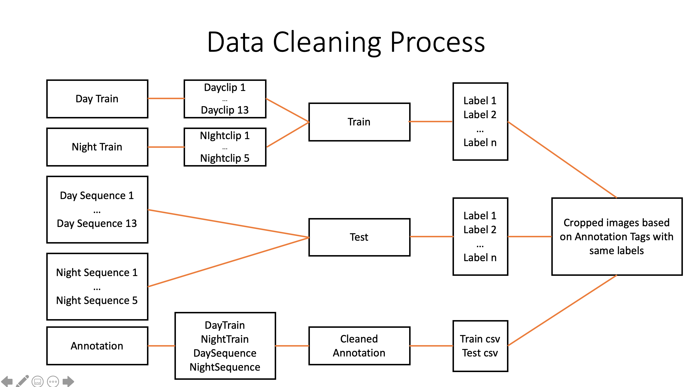

## Image comparison

### Raw image
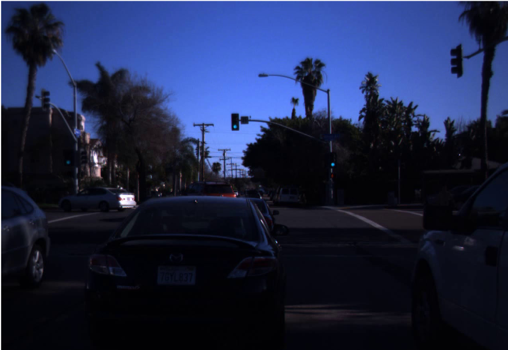

### cropped image


# EDA

Knowing the distribution of number of tags in each label is important. The EDA process visualizes the distribution and allows me to add in class weight based on the result into the CNN model.

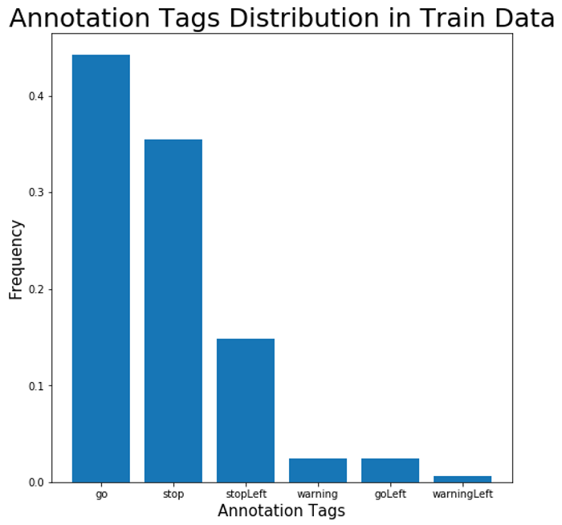


There are 6 labels (tags) total in the dataset: stop (red light), go (green light), stopLeft (red arrow), warning (yellow light), goLeft (green arrow), and warningLeft (yellow arrow). The distribution is similar in both train and test dataset. 'Stop' and 'go' labels cover the majority of tags. 

# Model

### Model Input 

- 3 layers of Convolution 2D with filter units (2x, x, x) and kernel size (a,2a,a)
- 2 layers of MaxPooling with pooling size (2,2)
- 2 layers of Dense with neurons (2x, x)
- 1 Flatten layer
- 2 layers of Dropout 
- Epochs = 15
- L2 regularizer with learning rate (0.05, 0.01)
- Callback method (EarlyStopping, ReduceLROnPlateau)
- Class weight based on each label’s count in Annotation csv: total_count / tag_count


### Model 1: muliclassification on full images

The first model is to train a CNN model on raw frames. The performance is not great, with an accuracy of 28% on train data and 13.11% on test data. In order to study the causes of the poor performance. I used cropped images as data and created 2 smaller binary models, with 1 model studying the classification performance on color and the 2nd model studying the classification performance on shape. 

The reason for this split is because most traffic signs in the dataset are either distinguished by color (go, stop, warning) or shape (goLeft, go). Studing the model performance separately might help me discover a direction to improve the model.

### Model 2: binary classification studying shape on cropped image

To study how a CNN model could classify shapes, I used two labels, 'go' and 'goLeft' from both train data and test data. According to the accuracy evaluation, the model performs pretty good, with a train accuracy of 99% and test accuracy of 92%. However, the early stop paused the model at epochs = 3 means that this model would perform worse if continues, as the trends of loss shows. 

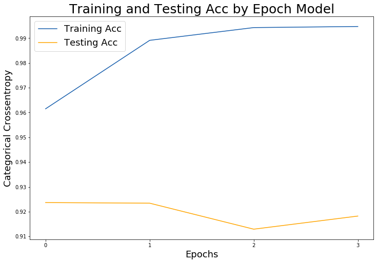
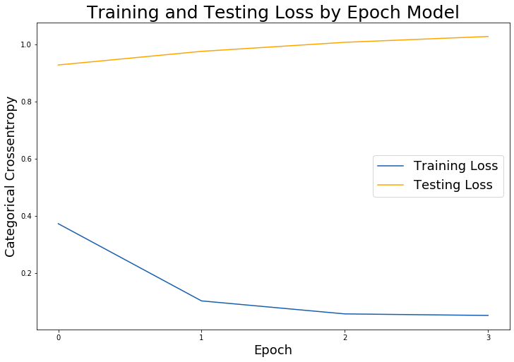

By evaluating the model performance through confusion matrix, I discovered that the potential causes for the reverse performance trends could be due to imbalanced sample and non-exclusive labels. There are significantly more 'go' labels than 'goLeft', and frames categorized as 'goLeft' could also be part of 'go', which could cause model to choose 'go' over 'goLeft' when the frame is labeled both. This could explain why the model has more False Positive than True Positive

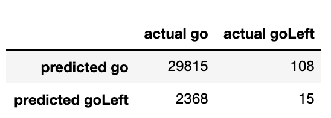
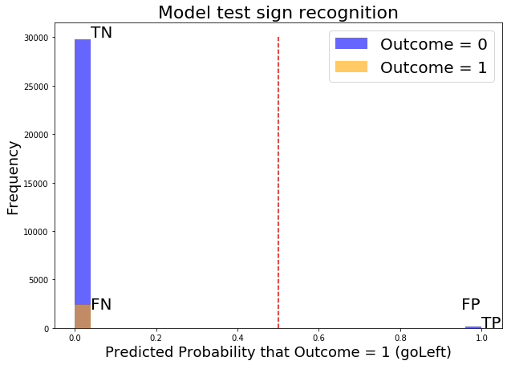

### Model 3: binary classification studying color on cropped image 

To study how a CNN model could classify color, I used two labels, 'go' and 'stop' from both train data and test data. According to the accuracy evaluation, the model performance seems to be good, with a train accuracy of 89% and test accuracy of 84%.

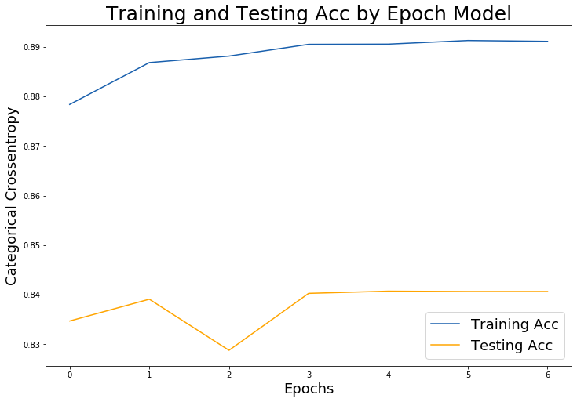
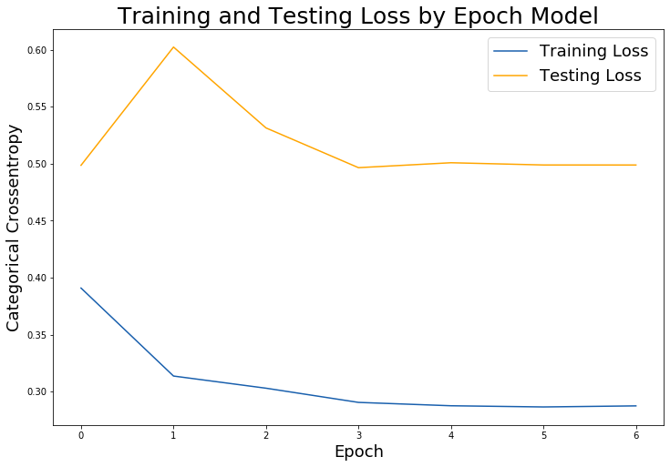

However, when I used confusion matrix to compare the prediction result with actual labels, the result was inaccurate, with only 50.9% accuracy. As we can see, the model did a particularly bad performance on predicting 'stop', as many of them were predicted as 'go'. Thus, the overall poor model performance could be largely caused by its inability to classify color

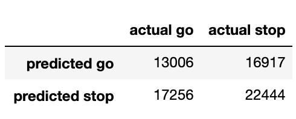
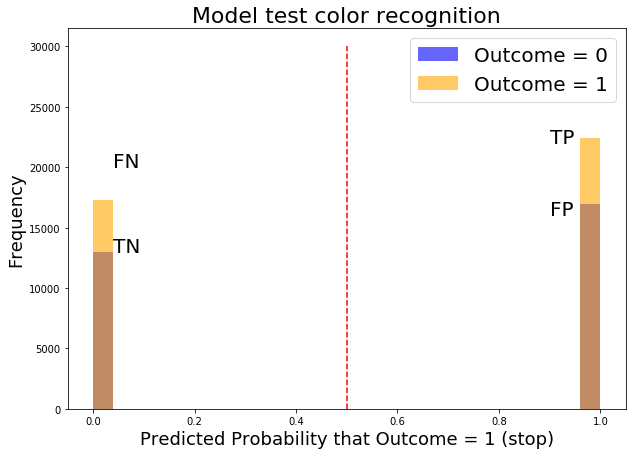

# Obstacles of the project

There are many obstacles that I was unable to solve within the project's timeframe, but they could be critical to model improvement

- Image resolution is too large to run on personal laptop
- The traffic signs in original frames are small, reducing resolution would make them even worse
- AWS has been causing trouble importing essential libraries to run the model such as Tensorflow
- Many annotation tags are wrong (ex. labels green light as ‘stop’ and  ‘red light’ as ‘go)
- Many images contain multiple lights with different labels
- Annotation tags are not mutually exclusive, many images labeled in ‘goLeft’ are also considered ‘go'

# Conclusion and next step

- The poor model performance could be a result of inaccurate labels and  low cropped image resolution 
- The dataset is unfit to run multi classification model due to non-exclusive labels
- AWS is required if the model is run with original resolution
- Identify and correct misplaced tags to build a better train / test data split


```python

```
